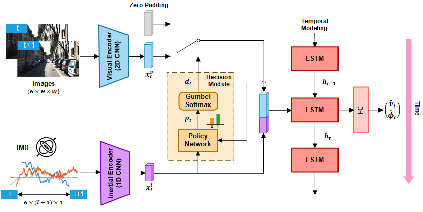

# Visual-Selective-VIO

This is the test code for the paper "Efficient Deep Visual and Inertial Odometry with Adaptive Visual Modality Selection". 

  

## Data Preparation

The code in this repository is tested on KITTI Odometry dataset. To download the KITTI dataset, please run `data/data_prep.sh`. The IMU data after pre-processing is provided under `data/imus`. 

## Download pretrainined models

Two pretrained models `vf_512_if_256_3e-05.model` and `vf_512_if_256_5e-05.model` are provided in [Link](https://drive.google.com/drive/folders/1KrxpvUV9Bn5SwUlrDKe76T2dqF1ooZyk). Please download the models and place them under `models` directory.

## Test the model

Example command:

      python test.py --gpu_ids '0' --model_name 'vf_512_if_256_3e-05'  

The figures and error records will be generated under `results`

## Results example

Estimated path (left), speed heatmap (middle) and decision heatmap (right) for path 07 using `vf_512_if_256_5e-05.model`. 

  

## Reference

> Mingyu Yang, Yu Chen, Hun-Seok Kim, "Efficient Deep Visual and Inertial Odometry with Adaptive Visual Modality Selection"

    @article{yang2022efficient,
      title={Efficient Deep Visual and Inertial Odometry with Adaptive Visual Modality Selection},
      author={Yang, Mingyu and Chen, Yu and Kim, Hun-Seok},
      journal={arXiv preprint arXiv:2205.06187},
      year={2022}
    }
